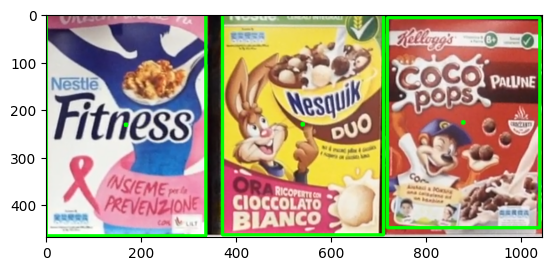
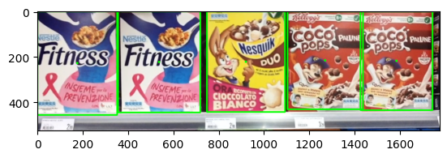

# Store-Shelf Product Recognition and Localization

Computer vision pipeline for recognizing cereal-box products on store shelves, localizing detected instances, and counting multiple occurrences using classical feature-based methods.

The project is implemented in Python and OpenCV and is organized into two stages:

- **Step A — Single-instance detection**
- **Step B — Multiple-instance detection**

## Overview

The pipeline detects known product models inside store-shelf images and returns both visual and textual results.

For each detected product, it:

- draws a bounding box around the detected instance;
- marks the estimated center position;
- identifies the corresponding product model;
- counts the number of detected instances;
- reports the center position, width, and height of each detection.

Product IDs correspond to the model indices used in the project dataset.

## Methods

### Step A — Single-Instance Detection

The first stage detects individual product instances using:

- SIFT keypoints and descriptors;
- FLANN-based feature matching;
- Lowe's ratio test;
- homography estimation with RANSAC;
- spatial-distribution checks on matched features;
- region-of-interest validation based on color consistency.

### Step B — Multiple-Instance Detection

The second stage extends the pipeline to detect multiple occurrences of the same product using:

- SIFT and FLANN feature matching;
- Lowe's ratio test;
- a Generalized Hough Transform-style voting procedure;
- scale and rotation information from local features;
- homography-based localization;
- color-consistency checks;
- Non-Maximum Suppression;
- Intersection over Union (IoU) to remove overlapping detections.

## Results

### Product Recognition and Localization

The pipeline recognizes product models in a shelf image, localizes each detected instance, and returns its position and size.



Example output:

```text
Product 0 - 1 Instances Found:
Instance 0 [ position: (170,237), width: 327 px, height: 453 px]

Product 2 - 1 Instances Found:
Instance 0 [ position: (474,192), width: 304 px, height: 384 px]
```

### Multiple-Instance Detection

The pipeline can also detect and count multiple instances of the same product within a shelf image.



Example output:

```text
Product 1 - 2 Instances Found:
    Instance 0 [ position: (498,723), width: 317 px, height: 418 px]
    Instance 1 [ position: (833,713), width: 310 px, height: 423 px]

Product 2 - 1 Instances Found:
    Instance 0 [ position: (159,712), width: 319 px, height: 413 px]

Product 3 - 1 Instances Found:
    Instance 0 [ position: (907,192), width: 300 px, height: 384 px]

Product 5 - 2 Instances Found:
    Instance 0 [ position: (562,229), width: 333 px, height: 457 px]
    Instance 1 [ position: (234,223), width: 338 px, height: 447 px]
```

## Technologies

Python · OpenCV · NumPy · SciPy · Matplotlib

## Project Structure

```text
product-recognition-store-shelves/
│
├── README.md
├── requirements.txt
├── .gitignore
│
├── notebooks/
│   ├── Step_A_single_instance_detection.ipynb
│   └── Step_B_multiple_instance_detection.ipynb
│
└── examples/
    ├── product_recognition_localization.png
    └── multiple_instance_detection.png
```

## Running the Project

Install the required packages:

```bash
pip install -r requirements.txt
```

Then open the notebooks in Jupyter Notebook or JupyterLab.

The notebooks expect the project images to be available in the folder structure used by the original coursework. The original dataset is not included in this repository.
